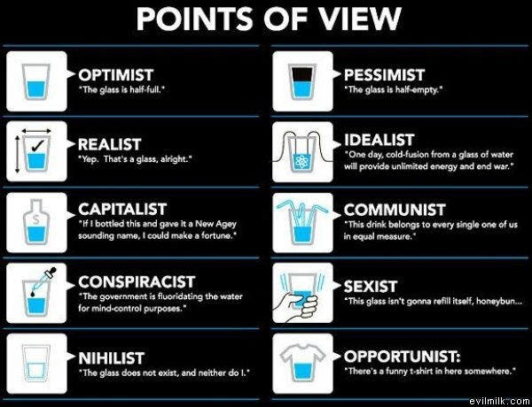

# Applied Data Science @ Columbia
## Fall 2022
## Project 1: A "data story" on the history of philosophy



### [Project Description](doc/)
This is the first and only *individual* (as opposed to *team*) project this semester. 

Term: Fall 2022

+ Projec title: How to speack like a certain school of philosophy
+ This project is conducted by Tim

+ Project summary: Philosophy is not an easy topic and it is not easy to speak like one. This project is dedicated to help someone who's interested in identifying different schools and try to speak like one. To begin with, I do not have any philosophical training or enough education background to allow me to make judgement on how to speak like a philosopher. However, I was thinking perhaps we can all learn something mechanically from the data. We will ask the computer to read those senteces for us even before we understand what it actually means, and then computer could tell us what can possibly be the characteristics of each school.

Through the analysis maybe we could learn philosophy in a more efficient way and we could even provide this result to expert and see if they agree with our findings. Or at least, I would like to see what are the tips if I want to talk like a certain school.

Following [suggestions](http://nicercode.github.io/blog/2013-04-05-projects/) by [RICH FITZJOHN](http://nicercode.github.io/about/#Team) (@richfitz). This folder is orgarnized as follows.

```
proj/
├── lib/
├── data/
├── doc/
├── figs/
└── output/
```

Please see each subfolder for a README file.
